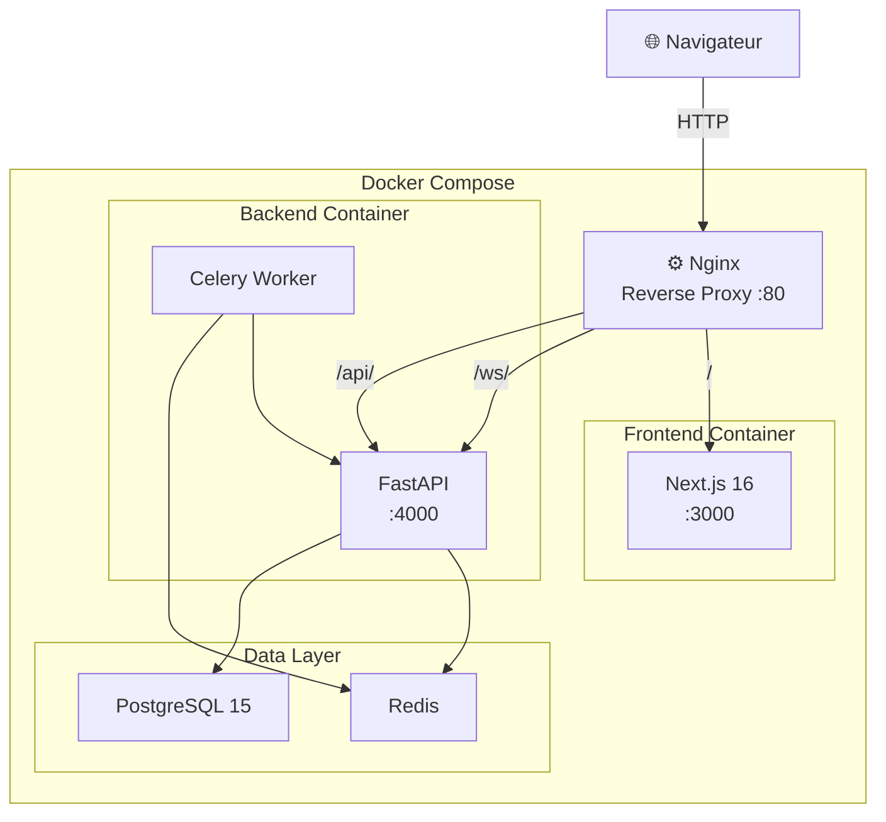

<div align="center">

# 🪙 Crypto-Explorer

**Plateforme crypto full-stack – marchés en temps réel, watchlist, portfolio & actualités**

<br />

[](https://circleci.com)
[](https://nextjs.org)
[](https://fastapi.tiangolo.com)
[](https://www.postgresql.org)
[](https://docs.docker.com/compose)
[](https://www.typescriptlang.org)
[](https://redis.io)

</div>

---

## 📖 Présentation

**Crypto-Explorer** est une application web full-stack permettant de suivre les marchés des cryptomonnaies en temps réel. Elle combine un dashboard interactif avec des graphiques en chandeliers (candlestick), une watchlist personnalisée, une simulation de portefeuille virtuel, et un blog d'actualités crypto.

Le projet adopte une architecture **microservices légère** : un frontend Next.js et un backend FastAPI découplés, communiquant via REST et WebSocket, le tout servi par un reverse proxy Nginx et orchestré avec Docker Compose.

---

## ✨ Fonctionnalités

| Module | Description |
|---|---|
| 📊 **Dashboard** | Prix des cryptos en temps réel (WebSocket), graphique candlestick, top gainers/losers, market overview |
| 👀 **Watchlist** | Suivi personnalisé de vos cryptos préférées, persisté en base |
| 💼 **Simulation** | Portefeuille virtuel, historique de trades, formulaire de retrait avec calcul des frais par pays |
| 📰 **Blog** | Articles et analyses crypto avec système de catégories |
| 👤 **Profil** | Gestion du compte, informations personnelles |
| 🔐 **Auth** | Inscription / connexion, JWT access token + refresh token en cookie `httpOnly strict` |
| 📧 **Contact** | Formulaire de contact avec envoi d'email via `aiosmtplib` |

---

## 🏗️ Architecture



**Flux de données :**
- `/` → Frontend Next.js (SSR + CSR)
- `/api/*` → Backend FastAPI (REST)
- `/ws/*` → Backend FastAPI (WebSocket, prix en temps réel)

---

## 🛠️ Stack technique

### Frontend
| Technologie | Rôle |
|---|---|
| **Next.js 16** + React 19 | Framework principal (App Router) |
| **TypeScript 5** | Typage statique |
| **Redux Toolkit** | State management global |
| **TailwindCSS v4** | Styling |
| **lightweight-charts** | Graphique candlestick |
| **tsparticles** | Background animé |
| **Vitest** + Testing Library | Tests unitaires |

### Backend
| Technologie | Rôle |
|---|---|
| **FastAPI** | Framework API asynchrone |
| **SQLModel** + asyncpg | ORM + driver PostgreSQL async |
| **Alembic** | Migrations de base de données |
| **Redis** + Celery | Cache et tâches asynchrones |
| **python-jose** | JWT (access + refresh tokens) |
| **aiosmtplib** | Envoi d'emails asynchrone |
| **pytest** + pytest-asyncio | Tests unitaires |

### Infrastructure
| Technologie | Rôle |
|---|---|
| **Docker** + Docker Compose | Conteneurisation |
| **Nginx** | Reverse proxy (REST + WebSocket) |
| **CircleCI** | CI/CD (tests auto sur `dev`) |
| **PostgreSQL 15** | Base de données relationnelle |

---

## 📁 Structure du projet

```
crypto_news/
├── frontend/                    # Application Next.js
│   ├── app/
│   │   ├── (public)/            # Pages publiques
│   │   │   ├── page.tsx         # Landing page
│   │   │   ├── blog/            # Blog & articles
│   │   │   └── login/           # Authentification
│   │   ├── (app)/               # Pages privées (auth requise)
│   │   │   ├── dashboard/       # Dashboard principal
│   │   │   ├── simulation/      # Portefeuille virtuel
│   │   │   ├── profil/          # Profil utilisateur
│   │   │   └── settings/        # Paramètres
│   │   ├── components/          # Composants métier
│   │   ├── ui/                  # Composants UI réutilisables
│   │   ├── lib/                 # Redux store, features, hooks
│   │   └── hooks/               # Custom hooks (useLogin, useRegistration…)
│   └── __tests__/               # Tests unitaires Vitest
│
├── backend/                     # Application FastAPI
│   ├── app/
│   │   ├── controllers/         # Routes API (auth, market, symbols…)
│   │   ├── services/            # Logique métier
│   │   ├── repositories/        # Couche accès données (pattern Repository)
│   │   ├── models/              # Modèles SQLModel
│   │   ├── schemas/             # Schémas Pydantic (request/response)
│   │   ├── auth/                # JWT token service
│   │   ├── db/                  # Session async, init DB
│   │   └── core/                # Configuration (JWT, settings)
│   └── tests/
│       └── unit/                # Tests unitaires pytest
│
├── nginx/
│   └── nginx.conf               # Reverse proxy config
├── docker-compose-dev.yml
├── docker-compose-prod.yml
└── .circleci/
    └── config.yml               # Pipeline CI/CD
```

---

## 🚀 Installation

### Prérequis

- [Docker](https://www.docker.com/get-started) ≥ 24
- [Docker Compose](https://docs.docker.com/compose/install/) ≥ 2.20

### 1. Cloner le dépôt

```bash
git clone https://github.com/<votre-username>/crypto_news.git
cd crypto_news
```

### 2. Configurer les variables d'environnement

```bash
cp .env.example .env
```

Remplir le fichier `.env` :

```env
# Environnement
ENV=DEV

# Ports
PORT_FRONT=3000
PORT_BACK=4000

# Base de données
DB_HOST=db
DB_USER=postgres
DB_PASSWORD=your_password
DB_NAME=crypto_news
DB_PORT=5432

# JWT
JWT_SECRET_KEY=your_very_secret_key
JWT_ALGORITHM=HS256
JWT_EXPIRATION_HOURS=24
JWT_REFRESH_EXPIRATION_DAYS=7

# Frontend
NEXT_PUBLIC_API_BACK_END=http://localhost/api
NEXT_PUBLIC_APP_URL=http://localhost:3000
```

### 3. Lancer en développement

```bash
docker compose -f docker-compose-dev.yml up --build
```

| Service | URL |
|---|---|
| Application | http://localhost |
| Frontend direct | http://localhost:3000 |
| API Backend | http://localhost/api |
| API Docs (Swagger) | http://localhost/api/docs |

### 4. Migrations de base de données

```bash
docker exec -it crypto_back alembic upgrade head
```

---

## 🧪 Tests

### Frontend (Vitest)

```bash
cd frontend
npm install
npm test               # Mode watch
npm run coverage       # Avec rapport de couverture
```

### Backend (pytest)

```bash
cd backend
pip install -r requirements.txt
pytest tests/unit -v
```

Les tests sont également lancés **automatiquement sur la branche `dev`** via CircleCI (frontend et backend en parallèle).

---

## 🔐 Sécurité

- **Access token** JWT (24h) stocké en mémoire côté client
- **Refresh token** JWT (7 jours) en cookie `httpOnly`, `SameSite=Strict`, `Secure` en production
- Cookie de refresh limité au chemin `/auth` uniquement
- Hachage des mots de passe avec **bcrypt**
- CORS configuré via Nginx en production

---

## 🌍 Production

```bash
docker compose -f docker-compose-prod.yml up --build -d
```

> Penser à mettre `ENV=PROD` dans le `.env` pour activer le flag `Secure` sur les cookies et les optimisations Next.js.

---

## 📄 Licence

Ce projet est sous licence **MIT**.

---

<div align="center">

Fait avec ❤️ par [Abdel1117](https://github.com/Abdel1117)

</div>
